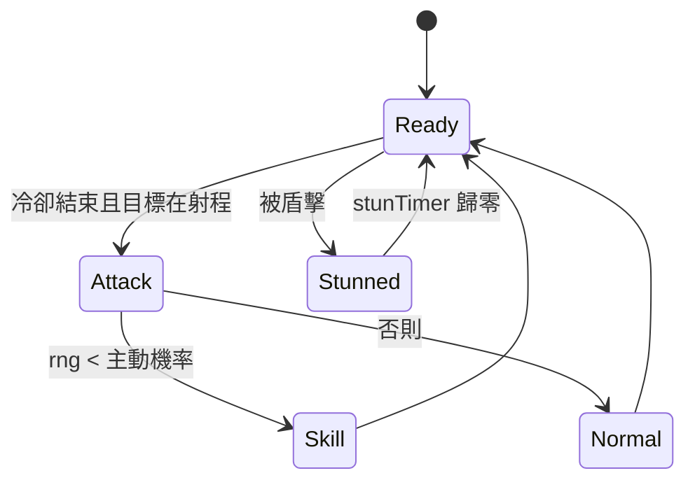

# PRD：職業技能（class-skills）

## 目標

現在的職業特性是固定規則（每第 3 刀旋風斬、固定護甲），打起來可預期。改成每個職業 1 個「機率觸發」的主動技能 + 1 個被動技能，讓每場出現連發、格擋、處決、閃現等意外時刻，觀眾看得出「發生了什麼」。隨機一律來自 seed，同 seed 重播結果不變。

## 範圍

- **Must**：
  - 五職業各 1 主動 + 1 被動（見下表），數值集中在 `src/engine/classes.ts`。
  - 主動技能：每次出手擲一次 `rng`，命中機率即觸發；取代劍士「每第 N 刀」。
  - 被動技能：條件或機率觸發（格擋、閃避、閃現、背水一戰、連射）。
  - 觸發時推 `skill` 事件；畫面在小人偶頭上顯示技能名浮字，並有對應光圈 / 粒子。
  - 被暈眩的小人偶頭上有暈眩標記，暈眩期間不移動、不出手、冷卻不倒數。
  - 設定頁職業介紹（`ClassGuide`）改為顯示主動、被動技能說明。
  - 平衡：30 人與 300 人各跑 ≥ 100 個 seed（取 1 名），每個職業勝率 ≤ 35% 且 ≥ 8%；30 人平均時長 50–75 秒。
  - 更新 golden test 期望值，總規格職業表同步。
- **Should**：
  - 技能音效沿用現有音效（旋風斬 `spin`、隕石 `explode`、其餘 `crit`），不新增音檔。
- **Won't**：
  - 技能池（每人從多個技能中抽一個）、技能升級、主動施放、技能冷卻 UI。
  - 新職業。

## 技能表（第二版，2026-10-06 依使用者要求調整；數值以 `classes.ts` 為準）

劍士改名「戰士」、弓箭手改名「遊俠」（內部 `ClassId` 維持 `swordsman` / `archer`）。

| 職業 | 主動（每次出手機率）                                                                   | 被動                                                                        |
| ---- | -------------------------------------------------------------------------------------- | --------------------------------------------------------------------------- |
| 戰士 | **旋風斬** 35%：主目標全額，半徑 46 內其他人吃 60%                                     | **戰意**：HP ≤ 50% 時造成傷害 ×1.5，但受到傷害 ×1.15（進入時顯示一次）      |
| 騎士 | **盾擊** 15%：正常傷害並使目標暈眩 0.8 秒                                              | **格擋** 8%：單體攻擊傷害歸零（護甲 15% 保留）                              |
| 遊俠 | **蓄力射擊** 25%：射出金色強力箭，傷害 ×1.8、箭速 ×1.6                                 | **貓鼬**：被近戰打到時 40% 機率往後閃 60（冷卻 3 秒，不出場地）             |
| 法師 | **魔法箭** 35%：火球改為魔法箭，傷害 ×1.2、速度 520，無視護甲、不能閃避格擋、不爆炸    | **魔法盾**：開場帶盾，抵擋一次任何傷害（含範圍，處決除外），破盾後 6 秒恢復 |
| 刺客 | **處決** 30%：目標 HP ≤ 15% 時，造成等同剩餘 HP 的傷害（無視護甲、格擋、閃避、魔法盾） | **閃避** 10%：單體攻擊傷害歸零                                              |

規則：

- 格擋、閃避只對單體主要傷害（近戰、箭、火球主目標）有效；範圍傷害（旋風斬波及、爆炸波及）與魔法箭不能格擋閃避。
- 魔法盾在閃避 / 格擋之前判定，任何傷害都會消耗護盾，只有處決穿透。
- 擲骰順序固定：出手時「爆擊 → 傷害 → 冷卻抖動 → 主動技能（處決只在目標殘血時擲）」，受傷時「魔法盾（不擲骰）→ 閃避 / 格擋 → 貓鼬」，全部用 `world.rng`。
- 處決不能爆擊顯示，事件 `crit = false`。

## 狀態與流程

## 資料與介面

- engine
  - `ClassStats`：移除 `spinEvery`；新增 `activeSkill: ActiveSkillId`、`activeChance`、`passiveSkill: PassiveSkillId` 與各技能參數（`spinRadius/Ratio`、`stunSec`、`chargedDamageMul/SpeedMul`、`missileDamageMul/Speed`、`executeHpRatio`、`furyHpRatio/DamageMul/TakenMul`、`blockChance`、`dodgeChance`、`mongooseChance/Distance/Cooldown`、`manaShieldCooldown`）。技能名稱放 `SKILL_NAMES`，說明文字由 `describeSkills(id)` 依數值產生。
  - `ActiveSkillId = 'spin' | 'shieldBash' | 'chargedShot' | 'magicMissile' | 'execute'`；`PassiveSkillId = 'fury' | 'block' | 'mongoose' | 'manaShield' | 'dodge'`；`SkillId` 為兩者聯集。
  - `Unit` 新增 `stunTimer`、`mongooseCooldown`、`shieldCooldown`（≤ 0 表示護盾可用）、`fury: boolean`。
  - `ProjectileKind = 'arrow' | 'chargedArrow' | 'fireball' | 'missile'`；`Projectile` 新增 `pierce`。
  - `BattleEvent` 新增 `{ type: 'skill'; tick; unit; skill: SkillId; x; y }`；現有 `spin`、`explode` 保留供光圈使用。
  - `applyDamage` / `applySplash` 新增位元旗標參數 `flags`：`HIT_SINGLE` 才擲閃避 / 格擋，`HIT_MELEE` 才觸發貓鼬，`HIT_PIERCE` 給魔法箭（無視護甲與閃避格擋），`HIT_TRUE` 給處決（無視一切防禦）。
  - 貓鼬瞬移時同步設定 `prevX/prevY = x/y`，畫面不內插滑行。
- render
  - `Effects.handle('skill')`：技能名浮字（主動藍、被動紫），存活 > 60 人時只顯示主動技能；各技能有光圈或粒子（蓄力金圈、魔法盾藍圈、戰意紅圈、貓鼬起點終點塵土）。
  - renderer：暈眩頭上轉星星；法師護盾可用時身上一圈淡藍光；蓄力箭金色加粗、魔法箭紫色光球加拖尾。
- game：`GameController` 依 `skill` 事件播音效（盾擊、處決、蓄力射擊、魔法盾借用爆擊音效）。
- React：`ClassGuide` 用 `SKILL_NAMES` 與 `describeSkills(id)` 顯示；無新 store 欄位。

## 邊界情況

| 編號  | 情境                                  | 預期行為                                       |
| ----- | ------------------------------------- | ---------------------------------------------- |
| EC-01 | 魔法盾可用時被範圍傷害波及            | 消耗護盾、不扣血                               |
| EC-02 | 被暈眩者是遠程且有投射物在飛          | 投射物照常命中；暈眩只停止本人移動、出手、冷卻 |
| EC-03 | 暈眩中又被盾擊                        | `stunTimer` 取兩者較大值，不疊加               |
| EC-04 | 貓鼬目的地超出場地                    | 夾在場地邊界內（距邊 ≥ 碰撞半徑）              |
| EC-05 | 處決 / 範圍技能造成存活數達到得獎人數 | 依現有規則立即停止，存活數不低於得獎人數       |
| EC-06 | 只剩 2 人且其中一人暈眩               | 正常進行；延長賽倍率照常保證結束               |
| EC-07 | 300 人大量技能浮字                    | 浮字池上限 60 維持，超過時丟棄最舊的           |
| EC-08 | 同 seed 重播                          | 所有技能觸發、名次、tick 數完全相同            |

## 非功能需求

- 效能：300 人 `step()` 每 tick ≤ 2ms（`world.perf.test.ts`）；熱迴圈不配置新陣列。
- 決定性：引擎內只用 `world.rng`；golden test 會改變（擲骰次數變了），更新前在開發紀錄寫明原因。
- 無障礙：`prefers-reduced-motion` 時技能不加震動、粒子減量；浮字照常顯示。
- RWD：`ClassGuide` 在 360px 寬不溢出。

## 驗收標準

- [x] AC-01：Given 同 seed 與名單，When 跑兩次，Then 技能事件序列、名次與 tick 數完全相同。
- [x] AC-02：Given 戰士 `activeChance = 1`，When 出手，Then 推 `skill`（`spin`）事件且半徑內其他敵人受到 `spinRatio` 比例傷害。
- [x] AC-03：Given 騎士盾擊命中，When 之後 `stunSec` 秒內，Then 目標位置不變、不出手；之後恢復。
- [x] AC-04：Given 遊俠觸發蓄力射擊，When 出手，Then 產生 `chargedArrow`，傷害與速度乘上對應倍率。
- [x] AC-05：Given 法師觸發魔法箭且目標是 `blockChance = 1` 的騎士，When 命中，Then 無視護甲扣血、不會被格擋、沒有爆炸。
- [x] AC-06：Given 遊俠受近戰傷害且貓鼬觸發，When 結算，Then 與攻擊者距離增加、仍在場地內、`mongooseCooldown` 秒內不再觸發；遠程傷害不觸發。
- [x] AC-07：Given 目標 HP ≤ `executeHpRatio` 的騎士或帶盾法師，When 刺客處決，Then 目標死亡，不會被格擋或魔法盾擋下。
- [x] AC-08：Given `dodgeChance = 1` 的目標，When 受單體攻擊，Then 不扣血並推 `skill`（`dodge`）事件；受範圍波及仍扣血。
- [x] AC-09：Given 戰士 HP 降到 `furyHpRatio` 以下，When 之後出手與受傷，Then 造成傷害 ×`furyDamageMul`、受到傷害 ×`furyTakenMul`，且 `fury` 事件只推一次。
- [x] AC-10：Given 30 人與 300 人各 ≥ 100 seed，When 統計勝率，Then 沒有職業超過 35%，30 人平均時長 50–75 秒。（下限 8% 在 300 人時未達成，見開發紀錄）
- [x] AC-11：Given 300 人，When 量測 `step()`，Then 每 tick ≤ 2ms。
- [x] AC-12：Given 設定頁，When 開啟職業介紹，Then 每個職業顯示主動與被動技能名稱與說明。
- [x] AC-13：Given 帶盾法師，When 受到第一次傷害（含範圍），Then 不扣血並推 `manaShield` 事件；`manaShieldCooldown` 秒後恢復。

## 開發紀錄

- 實作：`combatSystem` 出手時擲主動技能；閃避 / 格擋 / 背水一戰 / 閃現集中在 `applyDamage`，任何傷害來源都一致。測試在 `src/engine/systems/skills.test.ts`（16 條，涵蓋 AC-01–09 與 EC-01、03、04）。
- 與規格的差異：
  - `applyDamage` 選項改用位元旗標而非物件，避免每次命中配置物件（熱迴圈）；另加 `HIT_MELEE` 區分閃現觸發。
  - 連射直接把爆擊那一發的冷卻乘上倍率，不需要 `Unit.rapidFire` 欄位。
  - 技能說明不存字串，改由 `describeSkills()` 從數值產生，調平衡後介紹不會過時。
  - 盾擊被格擋 / 閃避時不暈眩。
- golden test：擲骰次數改變（主動技能、閃避、格擋、閃現）且職業數值調整，seed 20261006 的名次與 tick 數改變，已更新期望值。
- 平衡（取 1 名；10 / 30 人各 200 seed、100 / 300 人各 100 seed，300 人另跑 300 seed 確認）：

  | 人數 | 平均時長 | 劍士 | 騎士 | 弓箭手 | 法師 | 刺客 |
  | ---- | -------- | ---- | ---- | ------ | ---- | ---- |
  | 10   | 48s      | 23%  | 14%  | 20%    | 21%  | 22%  |
  | 30   | 54s      | 12%  | 12%  | 28%    | 29%  | 19%  |
  | 100  | 60s      | 22%  | 15%  | 23%    | 23%  | 17%  |
  | 300  | 60s      | 33%  | 26%  | 4%     | 8%   | 29%  |
  - 初版數值：刺客 30 人勝率 60%（處決 + 閃避 20%）、300 人時騎士 48%、遠程幾乎 0%。調降刺客閃避與處決門檻、騎士護甲 25%→15% 與格擋、劍士旋風斬波及 80%→50%，提高弓箭手 HP 500→640 與射程 135→150、法師 HP 520→560 與閃現機率。
  - 300 人時遠程仍偏弱（開場被人群包圍，平均名次百分位約 80%）；再提高遠程會讓 30 人時勝率超過 35%，依使用者「不要讓某職業特別容易贏」的要求，以上限為優先，停在這組數值。

- 效能：300 人 `step()` 平均 0.23ms、p95 0.58ms（改動前目標 ≤ 2ms）。
- 實機：30 人對戰中可見隕石、格擋、旋風斬、盾擊、閃現浮字與暈眩星星，console 無錯誤。

### 第二版（2026-10-06）

- 使用者要求：劍士改名戰士，被動改為「加傷害也加受傷」；騎士、刺客維持；弓箭手改名遊俠，技能改為蓄力射擊與貓鼬；法師改為魔法箭與魔法盾。使用者原文為「戰役」，實作取名「戰意」。
- 移除多重箭、隕石、背水一戰、連射、閃現；`Unit.blinkCooldown` / `berserk` 改為 `mongooseCooldown` / `fury`，新增 `shieldCooldown`、`Projectile.pierce`、`HIT_PIERCE`。
- golden test：技能與數值改變，再次更新期望值。
- 平衡（取 1 名；10 / 30 人 200 seed、100 / 300 人 100 seed，300 人另跑 300 seed）：

  | 人數 | 平均時長 | 戰士 | 騎士 | 遊俠 | 法師 | 刺客 |
  | ---- | -------- | ---- | ---- | ---- | ---- | ---- |
  | 10   | 49s      | 17%  | 12%  | 24%  | 25%  | 24%  |
  | 30   | 59s      | 12%  | 14%  | 30%  | 29%  | 16%  |
  | 100  | 67s      | 18%  | 20%  | 27%  | 24%  | 11%  |
  | 300  | 66s      | 26%  | 35%  | 6%   | 4%   | 30%  |
  - 初版新技能：遊俠 30 人勝率 48%（蓄力 ×2.2 太強），300 人時刺客 49%、法師 0%。調降蓄力倍率與機率、遊俠 HP 640→540、射程 150→140；法師 HP 560→600、魔法箭機率 35%、魔法盾恢復 6 秒；戰士旋風斬波及 60%、戰意傷害 ×1.5；騎士 HP 630；刺客 HP 660。
  - 300 人時遠程仍偏弱（同第一版原因），以「沒有職業超過 35%」為優先。

- 效能：300 人 `step()` 平均 0.21ms、p95 0.49ms。
