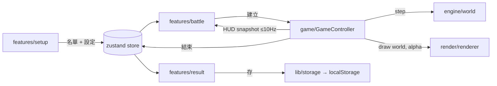

# PRD：抽獎大亂鬥（總規格）

## 目標

把抽獎變成一場看得下去的混戰：每個參加者（號碼或名字）是競技場上的一個像素小人偶，開打時隨機分配職業，自動尋敵、攻擊、淘汰，最後存活的 N 人就是得獎者。純娛樂、純前端，部署在 `https://kentfolio.dev/lottery-battle/`。

附帶目標：開發者（Vue 3 背景）透過這個專案練習 React 19 的元件、hooks、外部狀態同步與 Canvas 整合。

## 範圍

- **Must**
  - 參加名單：號碼範圍（起、迄、排除清單）或名單貼上（一行一人），2–300 人。
  - 設定：獎品 1–10 個（一個名次一個獎品，填幾個就取幾名，且小於參加人數）、seed（可留空自動產生）。
  - 職業：劍士、騎士、弓箭手、法師、刺客，用 seed 洗牌發牌，各職業人數最多差 1，每人拿到任一職業的機率相同。
  - 對戰：結果只由 seed 決定；自動尋敵、移動、近戰或發射投射物、死亡。
  - 延長賽：90 秒後全員傷害 ×2，之後每 30 秒再 +1 倍，保證一定結束（不使用縮圈）。
  - 像素小人偶：職業各有帽子與武器，衣服顏色每人不同，有站立、走路、攻擊動作。
  - 觀戰：存活數、經過時間、擊殺訊息、暫停、1x / 2x / 4x、直接看結果。
  - 結果：前三名頒獎台（站著得獎者的小人偶）、各名次獎品、完整名次表（名次、名稱、擊殺數、存活時間）、用同一個 seed 重播、同名單再開一場、複製結果文字。
- **Should**
  - 結尾戲劇效果：決戰時刻 / 賽點放慢與鏡頭拉近、最後一擊停格、慢動作與閃光（見 PRD-drama）。
  - 打擊特效：受擊閃白、傷害數字、死亡粒子、鏡頭輕微震動（尊重 `prefers-reduced-motion`）。
  - 歷史紀錄：最近 20 場存在 `localStorage`，可重播。
  - 深色主題、360px 寬可玩。
- **Could**
  - 音效（預設靜音）。
  - 隨機事件：補血包、狂暴、隕石（全員機率相同，維持公平）。
  - 擊殺王、最長存活等趣味統計。
- **Won't**
  - 後端、帳號、多人連線。
  - 玩家操控小人（全自動觀戰）。
  - 毒圈 / 縮圈（2026-10-06 依使用者要求移除）。
  - 讓使用者指定某人的職業（破壞公平）。

## 遊戲規則（平衡調整集中在 `src/engine/classes.ts` 與 `config.ts`）

| 職業   | HP  | 速度 | 射程 | 傷害  | 冷卻 | 特性                                 |
| ------ | --- | ---- | ---- | ----- | ---- | ------------------------------------ |
| 劍士   | 780 | 60   | 34   | 17–24 | 1.0  | 每第 3 刀旋風斬，周圍 46 內吃 80%    |
| 騎士   | 640 | 48   | 34   | 15–21 | 1.1  | 護甲減免 25% 傷害                    |
| 弓箭手 | 500 | 56   | 135  | 14–19 | 1.15 | 箭矢投射物、爆擊 15%，被貼近會後退   |
| 法師   | 520 | 50   | 125  | 22–30 | 1.5  | 火球爆炸半徑 50，周圍吃 55%          |
| 刺客   | 680 | 88   | 34   | 13–19 | 0.55 | 爆擊 35% ×2.2，優先刺殺 220 內的遠程 |

共通：場地 1000 × 1000、碰撞半徑 14（兩人中心至少相距 28，小人偶不會疊在一起）、30 tick/s、每 0.5 秒重新選目標、爆擊預設 10% ×2、延長賽 90 秒起每 30 秒傷害倍率 +1。

實測（每種人數 60–300 個 seed，取 1 名）：10 人平均 50 秒、30 人 60 秒、300 人 69 秒，最長 86 秒，皆未進入延長賽。勝率：30 人時劍士 29%、騎士 27%、弓箭手 20%、法師 16%、刺客 9%；300 人時近戰較有優勢（劍士、騎士各約 4 成）。遠程職業常在中期陣亡，但後期有機會翻盤。

同一個 tick 內的攻擊依 rng 洗牌後的順序逐一結算，已死亡的小人不能再出手，所以不會有雙殺導致存活人數低於得獎人數。

## 架構

- `engine` 是純函式與資料結構，可在 Node 測試；不碰 DOM。
- `GameController` 是 React 外部的物件，用 `requestAnimationFrame` 跑固定步長迴圈，直接呼叫 renderer 畫 Canvas；對 React 只暴露 `subscribe` / `getSnapshot`，由 `useSyncExternalStore` 讀 HUD 資料。
- 畫面切換（setup / battle / result）用 store 的 `phase`，不使用 router。

## 非功能需求

- 效能：300 人時畫面 ≥ 55 FPS（一般筆電）、`step()` 每 tick ≤ 2ms；首次載入 JS gzip ≤ 120KB。
- 公平與可驗證：結果頁顯示 seed；同 seed + 同名單 + 同設定重播，名次完全相同（有 golden test 保護）。
- 無障礙：控制按鈕可用鍵盤操作（Space 暫停、1/2/4 速度）；結果以表格呈現；只在宣布得獎者時使用 `aria-live`。
- RWD：最小 360px 寬。

## 驗收標準

- [x] AC-01：Given 號碼 1–50、得獎 3 人，When 開始對戰，Then 90 秒內（1x）結束並顯示 3 位得獎者與 50 列名次表。
- [x] AC-02：Given 一場結束的對戰，When 按「重播」，Then 名次與擊殺數完全相同。
- [x] AC-03：Given 300 人，When 對戰進行中，Then FPS ≥ 55。
- [x] AC-04：Given 部署在 `/lottery-battle/`，When 直接開啟網址，Then 資源全部正常載入。（2026-10-06 部署後確認）
